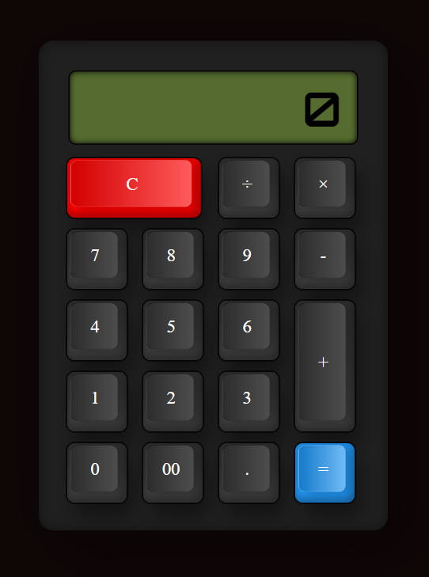

<h1 align="center">Calculadora React</h1>

O projeto consiste em uma calculadora retrô com React e estilizada com styled-components.  

  <a href="#-tecnologias">Tecnologias</a>&nbsp;&nbsp;&nbsp;|&nbsp;&nbsp;&nbsp;
  <a href="#-projeto">Projeto</a>&nbsp;&nbsp;&nbsp;|&nbsp;&nbsp;&nbsp;

  

 

  

## 💻 Projeto

Este web app de calculadora foi construido com React, utilizando os hooks useState, useEffect e useCallback e estilizada com styled-components. A calculadora teve inspiração nos modelos retrô, tanto no visual quanto nas funcionalidades. 
Para utiliza-la basta clicar nos botões ou digitar os números e operadores matemáticos no teclado.

## 🚀 Tecnologias

Esse projeto foi desenvolvido com as seguintes tecnologias:

- HTML e CSS
- React
- Styled-Components
- [NPM](https://nodejs.org/)

